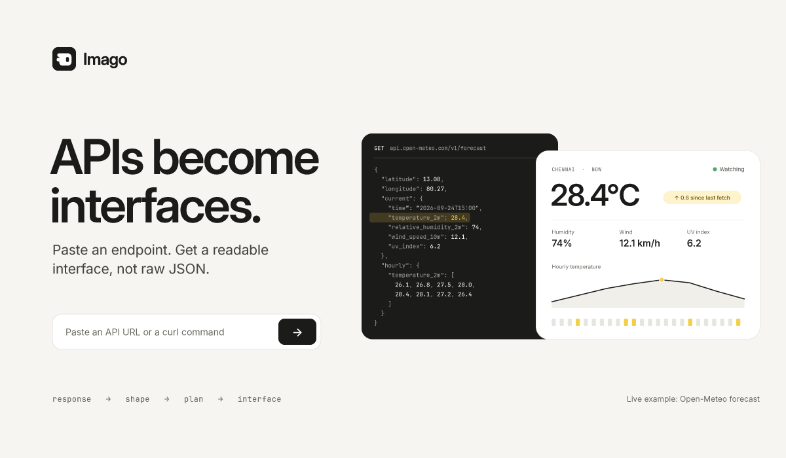

# You found an API. Now what?

You found a free API that might be what your project needs. A weather API, a
dictionary, a list of every Pokémon. The docs look fine. The only way to know
is to call it.

So you paste the URL into a tab and get this:

```json
{"latitude":13.125,"longitude":80.25,"generationtime_ms":0.04,"utc_offset_seconds":0,
"timezone":"GMT","current_units":{"time":"iso8601","interval":"seconds",
"temperature_2m":"°C","wind_speed_10m":"km/h"},"current":{"time":"2026-09-25T08:00",
"interval":900,"temperature_2m":31.4,"wind_speed_10m":12.9},"hourly_units":…
```

It's all there, and you can't read any of it. You scroll, you squint, you work
out that `31.4` is the temperature and `°C` lives in a different object. Then
you do what everyone does: write a throwaway page, just to see the data
properly, before you've decided whether to use this API at all.

**Imago is that throwaway page, drawn for you.**

Paste the endpoint into [imago.onslate.in](https://imago.onslate.in). Imago
fetches it, works out the response's shape and draws the interface it
deserves: the temperature as the headline, with its unit attached, the wind
beside it, the hourly forecast as a chart, and the bookkeeping
(`generationtime_ms`, `utc_offset_seconds`) folded away at the bottom.

A Pokémon becomes a profile with type badges and stat bars. A book search
becomes a table. A response full of links becomes a page of buttons, so you can
walk the API the way its authors meant.

## What makes it different

**It reads shape, not names.** Imago doesn't know what a Pokémon or a forecast
is. It sees a number with a `_units` sibling, a list of timestamps, an array of
objects that each have a name, and draws those. So it works on the API you
found this morning, not only the ones it was built with.

**It remembers.** Two responses with the same structure get the same page, and
the model is only asked once per shape. Turn on **Watch** and Imago re-fetches
every 10, 30 or 60 seconds, highlighting exactly which values moved since the
last fetch.

**It needs nothing from you.** No account, no install. With no key, you get a
clean basic layout. With a free Gemini or Groq key, you get a designed page.
The key stays in your browser, because there is no server to send it to.

**It shares safely.** **Share** copies a link that opens the same page for a
teammate, with the endpoint and the layout, and never your headers or keys.

## What it doesn't do

Imago reads public GET endpoints that allow browser apps (CORS). It doesn't
send POSTs, run test suites or reach your company's internal APIs. Postman
and Insomnia are better at those, and Imago isn't trying to replace them. It's
for the first ten minutes with an API, before any of that matters.

## Try it

- **Open the app:** [imago.onslate.in](https://imago.onslate.in)
- **A live example:** [a forecast for Chennai](https://imago.onslate.in/#open=https://api.open-meteo.com/v1/forecast?latitude=13.08&longitude=80.27&current=temperature_2m,wind_speed_10m&hourly=temperature_2m&forecast_days=1)
- **Run an API?** Give your readers an [Open in Imago](open-in-imago.md) badge.
- **Code:** [github.com/Sibhimanyu/imago](https://github.com/Sibhimanyu/imago), MIT.

It's free. There's no server to pay for, so there's nothing to charge for.
